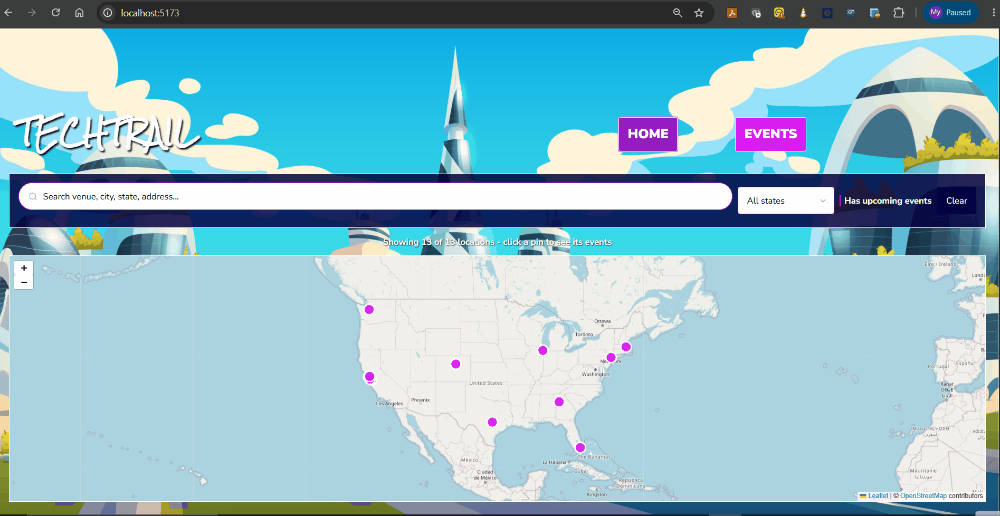
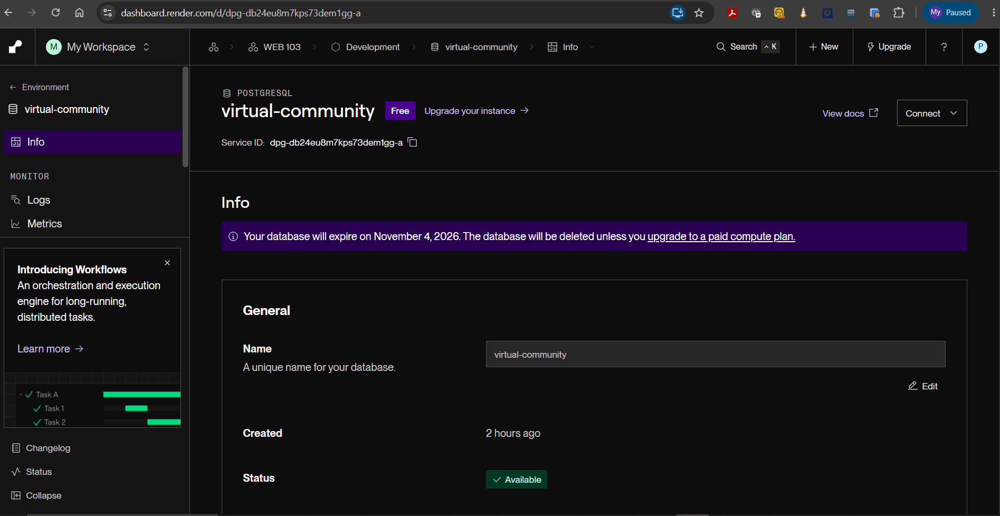
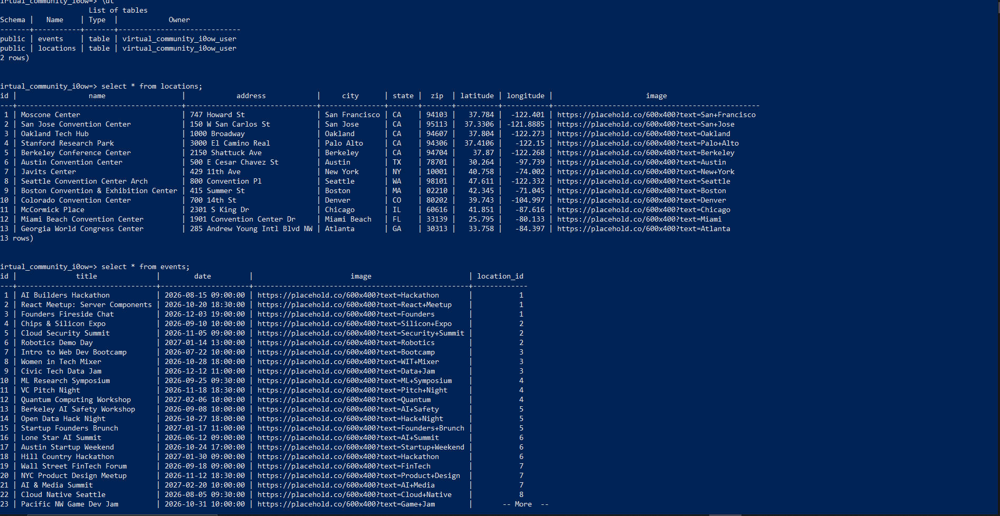

# WEB103 Project 3 - *TechTrail*

Submitted by: **My Pham**

About this web app: **TechTrail is a virtual community space for tech events across the US. Users explore an interactive map with a pin for each venue, click a pin to see that venue's events, and browse or search every event on an Events page. Upcoming events show a live countdown and past events are visibly marked.**

Time spent: **3** hours

## Required Features

The following **required** functionality is completed:

<!-- Make sure to check off completed functionality below -->

- [x] **The web app uses React to display data from the API**
- [x] **The web app is connected to a PostgreSQL database, with an appropriately structured Events table**
  - [x]  **NOTE: Your walkthrough added to the README must include a view of your Render dashboard demonstrating that your Postgres database is available**
  - [x]  **NOTE: Your walkthrough added to the README must include a demonstration of your table contents. Use the psql command 'SELECT * FROM tablename;' to display your table contents.**
- [x] **The web app displays a title.**
- [x] **Website includes a visual interface that allows users to select a location they would like to view.**
  - [x] *Note: A non-visual list of links to different locations is insufficient.* 
- [x] **Each location has a detail page with its own unique URL.**
- [x] **Clicking on a location navigates to its corresponding detail page and displays list of all events from the `events` table associated with that location.**

The following **optional** features are implemented:

- [x] An additional page shows all possible events
  - [x] Users can sort *or* filter events by location.
- [x] Events display a countdown showing the time remaining before that event
  - [x] Events appear with different formatting when the event has passed (ex. negative time, indication the event has passed, crossed out, etc.).

The following **additional** features are implemented:

- [x] Interactive Leaflet / OpenStreetMap map of 13 locations in 9 states; the map zooms to fit whichever locations the filters leave visible
- [x] Search and filter bar on the home page (venue, city, state, address, zip, state dropdown, "has upcoming events")
- [x] Search, filter, and sort bar on both the Events page and each location's detail page (search by title, venue, city, or date; upcoming vs. past; sort by date or title)
- [x] Live countdown that ticks every second, plus "Ended N days ago" text for past events
- [x] Locations and events seeded from JS data files with a `reset.js` script; `events.location_id` is an indexed foreign key to `locations`, and the API joins the two tables in SQL

## Video Walkthrough

Here's a walkthrough of implemented required features:

Render dashboard showing the Postgres database is available:

Table contents shown with psql (`SELECT * FROM events;` and `SELECT * FROM locations;`):

<!-- Replace this with whatever GIF tool you used! -->
GIF created with ScreenToGif
<!-- Recommended tools:
[Kap](https://getkap.co/) for macOS
[ScreenToGif](https://www.screentogif.com/) for Windows
[peek](https://github.com/phw/peek) for Linux. -->

## Notes

- The starter shipped with a decorative SVG skyline whose clickable shapes did not fit tech venues, so I replaced it with a Leaflet map. Locations store `latitude` and `longitude` in the database.
- The Express API is mounted under `/api` and the Vite dev proxy forwards `/api` to the server, so React fetches relative URLs and there are no hardcoded ports in the client.
- Events are joined to their location in SQL, not in the browser: `GET /api/locations/:id/events` runs a `JOIN` on `events.location_id = locations.id` so each location page downloads only its own events, and `GET /api/events` returns every event with its venue name, city, and state. `events.location_id` is indexed.
- The `Event` card receives its data as props, and `utils/dates.js` holds the countdown and date formatting helpers. All countdowns share one 1-second timer (`utils/useNow.js`) instead of one timer per card.
- Search, filter, and sort run in the browser, which is fine at this data size; with thousands of events they would move into the API as query parameters.
- To run: add `server/.env` with the Render `PG*` values, run `node config/reset.js` from `server/` to create and seed the tables, then `npm run dev` from the project root.
- Map tiles come from OpenStreetMap, so the map needs an internet connection.

## License

Copyright 2026 My Pham

Licensed under the Apache License, Version 2.0 (the "License"); you may not use this file except in compliance with the License. You may obtain a copy of the License at

> http://www.apache.org/licenses/LICENSE-2.0

Unless required by applicable law or agreed to in writing, software distributed under the License is distributed on an "AS IS" BASIS, WITHOUT WARRANTIES OR CONDITIONS OF ANY KIND, either express or implied. See the License for the specific language governing permissions and limitations under the License.